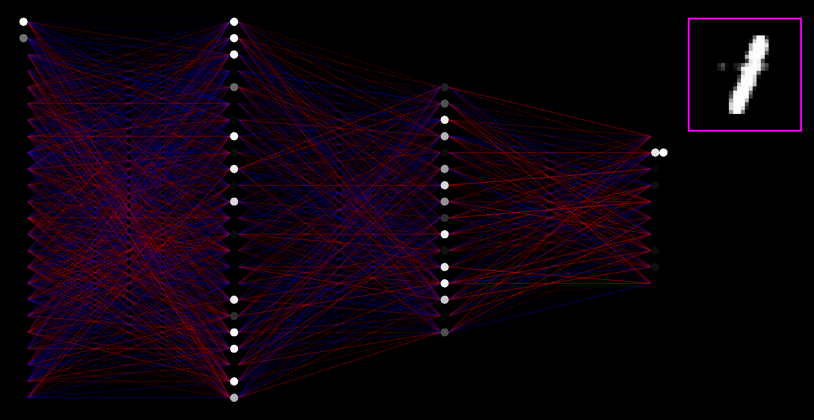
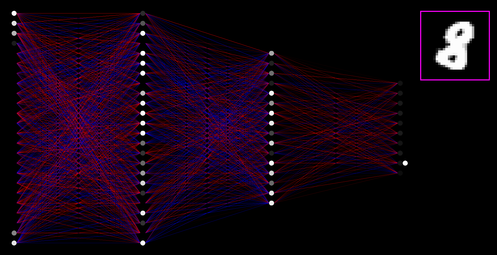
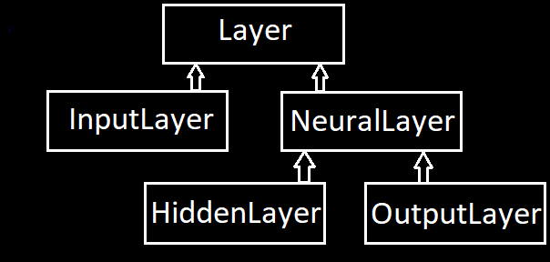

## "WARNING: The program (and the video below) may potentially trigger seizures for people with photosensitive epilepsy."

## -> [A VIDEO SHOWING HOW THE PROGRAM EXACTLY WORKS]() <-

## Table of contents
* [What is Small Neural Net Visualization?](#What-is-Small-Neural-Net-Visualization?)
* [Installation](#Installation)
* [Usage](#Usage)
* [How does it work?](#How-does-it-work?)
* [Status](#Status)
* [Bibliography, inspiration and sources](#Bibliography,-inspiration-and-sources)

## What is Small Neural Net Visualization?
The program visualizes how a small neural network learns to classify digits.

## Installation
If you use Visual Studio (like me) you can just clone the repo using this IDE and then run the program.
Use release configuration for greater speed of learning.
I don't know how to run such a program without IDE, but it shouldn't be difficult if you don't use IDE on a daily basis,
because everything (including files of the graphics library that the program uses) is in the repo. 
You don't need to install anything, running the program requires only a setup.
The program was written in C++ 14 and it should be able to run using newer standards.

## Usage
There are only a couple of things you can control:
Let's divide them into 2 categories:  
a) things you can control while the program is running  
b) things that can be changed before you run the program.

a)
- You can pause/unpause the program by pressing space key on your keyboard,
- you can show/hide the net background by pressing N key,
- you can show/hide the layers backgrounds by pressing L key;

b) you can change parameters of the net using config/net.ini file:
- 0/1 - brand-new net/already trained net will be loaded  
- 4 - total number of layers (has to be >=2)  
- 784 24 16 10 - the sizes of the layers  
- 1.0 - learning rate (the bigger the number the faster the net learns, the smaller the more precise the learning process is)  
- 32 - mini batch size - after how many digits the parameters of the net are updated  
- (the BIGGER the number the more precise the learning process is, the SMALLER the faster the net learns)  
- 50 50 - the position of the net in the window  
- 1500 - the width of the net  
- 50 50 50 255 - the color of the background of the net (red, green, blue, transparency) (0 <= each number <= 255)  
- 255 0 255 255 - the color of the background of the layers of the net  
- 0 0 255 255 - the color of the background of the desired outputs  
- 255 255 255 255 - the base color of the neurons, inputs and desired outputs  
- 0/1 - is the background of the net rendered by default (no/yes)  
- 0/1 - are the backgrounds of the layers of the net rendered by default (no/yes)

## How does it work?
The program learns using MNIST dataset, which contains 60'000 images. Each image is a gray 28x28 pixels square.
After each epoch of learning (epoch - analyzing all 60k training images) the accuracy of the net is tested
using additional 10k images (also from MNIST dataset).

In the top right corner of the window there is a square where the current analyzed digit is rendered.
The last layer shows desired outputs. At the very beginning they don't look like outputs, the net is dumb.


The colors of synapses and neurons are random. Red synapses have negative value and the blue ones have positive value.
The synapse is just a number connecting 2 neurons. Each neuron is connected to all neurons in the next layer.
The smaller the absolute value of a synapse weight the more transparent the color of this synapse is
(the closer to 0 the number is the less visible the synapse is).  
What about neurons?
The net uses sigmoid activation function, so the set of neurons values is <0; 1>.
Neurons with activation value equal to 1 are completely white 
and neurons with activation value equal to 0 are completely transparent. The greater the value the whiter the color.

Notice that not all inputs are rendered. There are 784 inputs, so only those located in the center of images are rendered.

The program is written using OOP and uses SFML library to render a window and take inputs from the user.

The main function contains only 2 lines:
```cpp
int main()
{
    App app;
    app.run();
}
```
App class is where everything starts and ends.

Let's see how App::run() function looks like:
```cpp
void App::run()
{
	std::cout << "App is now running:\n";

	while (m_window.isOpen())
	{
		update();
		render();
	}
}
```
So as you can see the program consists of 2 part. One of them is updating and the second is rendering.
Rendering isn't complicated because the only thing it does is calling render functions of different objects 
like Synapse class object which contain only a couple of lines.
```cpp
void Synapse::render(sf::RenderTarget& target) const
{
	if (!m_isRendered)
	{
		return;
	}

	target.draw(&m_line[0], m_line.size(), sf::Lines);
}
```
The last line of this function is the way how you draw a line using SFML library.

Everything tricky and fancy happens in the updating part. In each frame of the program exactly one digit is shown to the net.
Notice that a frame of the program isn't equal to a frame on your screen. Not necessarily all frames of the program 
(not necessarily all digits) are shown on the screen. How many of them are shown depends on
your graphics card and maximum FPS count of your screen.  
On my laptop approximately 60 frames per second are shown on the screen
and the program analyzes a couple of hundreds images per seconds.

The biggest class is NeuralNet class. It can be constructed in 2 different ways:
```cpp
public:
	NeuralNet(
		const std::vector<unsigned>& topology,
		const Scalar& learningRate,
		unsigned miniBatchSize,
		const sf::Vector2f& pos,
		const sf::Vector2f& size,
		const sf::Color& bgColor,
		const sf::Color& layersBgColor,
		const sf::Color& desiredOutputsBgColor,
		const sf::Color& baseNeuronsColor,
		bool bgIsRendered,
		bool layersBgAreRendered
	);
	NeuralNet(const std::string& filePath);
```
creating an object from scratch or loading an existing one saved in a file.

The heart of Net class are its 2 members:
```cpp
std::vector<std::unique_ptr<Layer>> m_layers;
std::vector<SynapsesMatrix> m_synapses;
```

Layer class is an abstract class from which derive InputLayer, NeuralLayer (also an abstract class), HiddenLayer and OutputLayer.


The program uses polymorphism to deal with the layers of the net.
Each layer except InputLayer contains a vector of Neuron class objects.

SynapsesMatrix class is just a wrapper of Synapse class objects matrix.

I'm not going to explain how exactly neural networks work and learn
but in [Bibliography, inspiration and sources](#Bibliography,-inspiration-and-sources) section 
there is a link to the source from which I learned all those things.  

## Status
The project is finished but probably there are still things that can be improved and some features that can be added.

## Bibliography, inspiration and sources
I learned how neural networks work from these videos:
https://www.youtube.com/playlist?list=PLZHQObOWTQDNU6R1_67000Dx_ZCJB-3pi

##
Mateusz Kozłowski 2022
